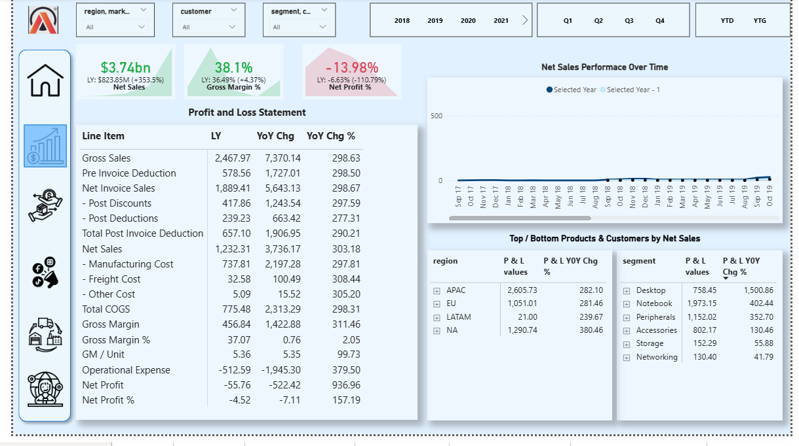
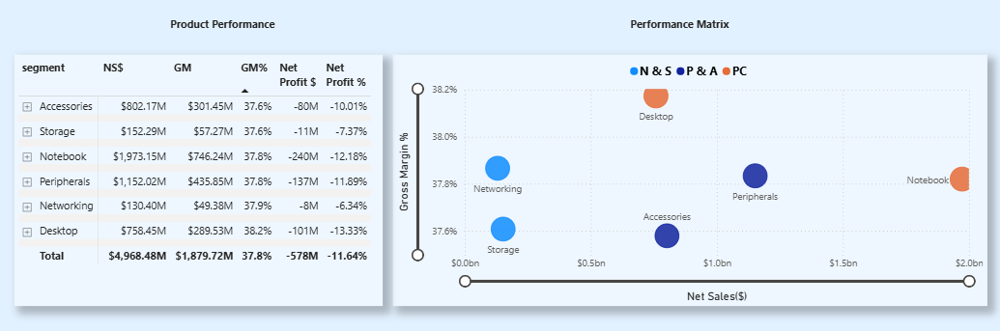
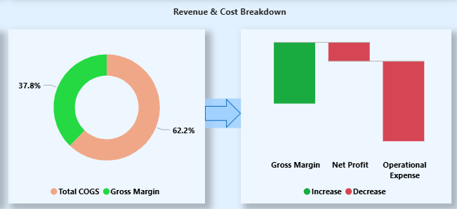

<h1><strong>Business Insights 360</strong></h1>
<h3><strong>Cross-Functional Business Performance Analytics Across Finance, Sales, and Supply Chain</strong></h3>

<h2><strong>Analysis Overview</strong></h2>

Business Insights 360 is an end-to-end business intelligence solution designed to support data-driven decision-making across finance, sales, marketing, and supply chain functions.

This analysis consolidates operational and financial data into interactive Power BI dashboards, enabling stakeholders to monitor performance, understand profitability drivers, and identify operational issues across multiple markets, products, and sales channels.

Rather than analysing one function in isolation, the solution provides a unified view of business performance to support both strategic oversight and day-to-day decision-making.

<h2><strong>Business Context</strong></h2>

AtliQ Hardware is a growing hardware and electronics company operating across physical retail and online sales channels. As the business expanded across regions, products, and customer segments, leadership required a centralised reporting solution to gain consistent visibility into performance, profitability, and operational efficiency.

Prior to this initiative, insights were fragmented across different functions, making it difficult to assess performance holistically or identify issues early.

<h2><strong>Problem Statement</strong></h2>
<ul>
<li>How is the business performing financially across time and regions?</li>
<li>Which products and customers drive revenue and profitability?</li>
<li>Why is profitability declining even when sales are growing?</li>
<li>How accurate are demand forecasts, and where is inventory risk occurring?</li>
</ul>

This project was built to solve those challenges by standardising key metrics and presenting them in role-based dashboards.

<h2><strong>Tools & Technologies</strong></h2>
<ul>
<li>SQL for data extraction and preparation</li>
<li>Power BI Desktop for data modelling, analysis, and dashboard development</li>
<li>DAX for calculated measures and business metrics</li>
<li>DAX Studio for model optimisation</li>
<li>Power BI Service for report publishing and sharing</li>
</ul>

<h2><strong>Financial Performance Dashboard (P&amp;L View)</strong></h2>

<h3> Objective</h3>

Provide an executive-level Profit &amp; Loss view to track revenue, costs, and profitability across time and business dimensions.

<h3> Key KPIs (Executive Summary)</h3>
<ul>
<li><strong>Net Sales:</strong> $3.74bn (+353.5% YoY)</li>
<li><strong>Gross Margin %:</strong> 38.08% (+2.47% vs LY)</li>
<li><strong>Net Profit %:</strong> -13.98% (-6.78% vs LY)</li>
</ul>

<strong>What these KPIs mean:</strong> 
These KPIs summarize whether the company is growing revenue, maintaining healthy margins, and converting sales into profit.

<h3> What This Dashboard Enables</h3>
<ul>
<li>Tracks company performance using a structured P&amp;L statement (Sales → Costs → Profitability)</li>
<li>Compares current performance vs last year (LY) using YoY change and YoY %</li>
<li>Monitors Net Sales trend over time to identify growth consistency and seasonality</li>
<li>Breaks down performance by region, customer, and product segment</li>
</ul>

<h3> Key Insights (From the Default View)</h3>
<ul>
<li>Net Sales shows strong growth ($3.74bn, +353.5% YoY).</li>
<li>Gross Margin improved to 38.08%, indicating better margin efficiency vs last year.</li>
<li>Net Profit remains negative (-13.98%), meaning costs are still outweighing profit.</li>
<li>Revenue contribution is concentrated in APAC and North America, while LATAM remains minimal.</li>
</ul>

<h3>🛠 Technical Highlights</h3>
<ul>
<li>Built dynamic LY, YoY Change, and YoY% measures using DAX</li>
<li>Implemented time intelligence for Year, Quarter, and YTD analysis</li>
<li>Designed an interactive P&amp;L table with slicers for business dimensions</li>
<li>Created a Net Sales trend comparison (current year vs prior year)</li>
</ul>

<h2><strong>Sales Performance Dashboard</strong></h2>

  <strong>Sales Performance Dashboard:</strong>
  <a href="dashboards/sales-performance.png" target="_blank">
    View Full Screenshot
  </a>

<h3>🎯 Objective</h3>

Evaluate revenue contribution and profitability across products and customers to identify key sales drivers.

<h3>📊 What This Dashboard Shows</h3>
<ul>
<li>Revenue (Net Sales) by product segment</li>
<li>Gross Margin % by segment</li>
<li>Customer contribution to total revenue</li>
<li>Revenue compared against profitability</li>
</ul>

<strong>What this means:</strong> 
This dashboard shows which products and customers drive revenue and how profitable those sales are.

<h3>🔎 Key Insights</h3>
<ul>
<li>Revenue is concentrated in core product segments such as Notebook and Desktop.</li>
<li>Some segments generate strong sales but lower profit margins.</li>
<li>A small group of customers contributes a large share of total revenue.</li>
<li>Profitability differs across segments, indicating uneven performance.</li>
</ul>

<h3>🛠 Technical Highlights</h3>
<ul>
<li>Calculated revenue and margin metrics using Power BI measures</li>
<li>Built interactive visuals to compare sales and profitability</li>
<li>Enabled filtering by year, product, and customer</li>
<li>Designed the dashboard to support contribution and performance analysis</li>
</ul>

<h2><strong>Product &amp; Profitability Analysis Dashboard</strong></h2>

<table>
  <tr>
    <td align="center" style="padding-right:12px;">
      <strong>Product Performance Overview</strong>  
      
    </td>
    <td align="center" style="padding-left:12px;">
      <strong>Product Revenue &amp; Margin Analysis</strong>  
      
    </td>
  </tr>
</table>

<h3>🎯 Objective</h3>

Evaluate product and market performance by analyzing revenue contribution, gross margin efficiency, and bottom-line profitability across segments.

<h3>📊 What This Dashboard Shows</h3>
<ul>
<li>Net Sales (NSS) by product segment</li>
<li>Gross Margin (GM) and GM% comparison</li>
<li>Net Profit $ and Net Profit % by segment</li>
<li>Revenue vs Gross Margin performance matrix</li>
<li>Revenue &amp; Cost Breakdown (Deductions → Margin structure)</li>
</ul>

<strong>Meaning for recruiters:</strong> 
This dashboard assesses which products drive revenue, how efficiently they generate margin, and where profitability pressure exists.

<h3>🔎 Key Insights</h3>
<ul>
<li>Revenue concentration: Notebook and Peripherals generate the highest Net Sales, making them primary revenue drivers.</li>
<li>Stable gross margin: GM% remains consistent across segments (~37–38%), indicating production cost efficiency is relatively stable.</li>
<li>Profitability challenge: Despite healthy gross margins, all segments report negative Net Profit %, suggesting operating expenses are significantly impacting bottom-line performance.</li>
<li>Break-even proximity: Networking shows the smallest net loss margin, positioning it closest to profitability.</li>
<li>Revenue vs Margin positioning: High-revenue segments are not necessarily the most profitable, highlighting a disconnect between scale and bottom-line performance.</li>
</ul>

<h3>📈 Strategic Interpretation</h3>

The business demonstrates strong revenue generation and stable production efficiency. However, persistent negative net profit across all segments indicates that profitability constraints are likely driven by high operating overhead rather than cost of goods sold (COGS).

<h3>🛠 Technical Implementation</h3>
<ul>
<li>Built dynamic NSS, GM, GM%, and Net Profit measures in Power BI</li>
<li>Designed a revenue vs margin matrix to visualize segment positioning</li>
<li>Structured performance comparison across product segments</li>
<li>Implemented interactive filters for time, region, and customer analysis</li>
</ul>

<h2><strong>Supply Chain &amp; Forecast Accuracy Dashboard</strong></h2>

<strong>View Dashboard Screenshot:</strong> supply-chain-forecast.png

<h3>🎯 Objective</h3>

Evaluate the reliability of demand forecasts and identify inventory risks caused by over- or under-forecasting.

<h3>📊 Key Performance Indicators</h3>
<ul>
<li><strong>Forecast Accuracy:</strong> 81.17%</li>
<li><strong>Net Error:</strong> -3.47M (indicating overall over-forecasting)</li>
<li><strong>Absolute Error:</strong> 6.90M</li>
</ul>

<strong>What this means:</strong> 
This dashboard measures how accurate demand predictions are and highlights whether the business is at risk of excess inventory or stockouts.

<h3>🔎 Key Insights</h3>
<ul>
<li>Overall forecast accuracy is around 81%, indicating moderate reliability in demand planning.</li>
<li>Negative Net Error suggests the business tends to overestimate demand, increasing excess inventory risk.</li>
<li>Some segments (e.g., Peripherals) show lower accuracy and significant over-forecasting exposure.</li>
<li>Other segments (e.g., Desktop, Storage) show positive Net Error, indicating under-forecasting and potential stockout risk.</li>
<li>Forecast performance varies across months, showing demand volatility.</li>
</ul>

<h3>📈 Operational Interpretation</h3>

Although overall forecasting performance is reasonably stable, directional errors (positive or negative Net Error) create inventory imbalances.
Improving forecast precision, especially in high-volume segments, would reduce both excess stock and lost sales opportunities.

<h3>🛠 Technical Implementation</h3>
<ul>
<li>Calculated Forecast Accuracy %, Net Error, and Absolute Error using DAX</li>
<li>Built risk classification logic (Excess Inventory vs Out of Stock)</li>
<li>Designed monthly trend analysis comparing current year vs last year</li>
<li>Enabled product and customer-level forecast evaluation</li>
</ul>

<h2><strong>Recommendations (Actionable Next Steps)</strong></h2>
<ul>
<li>Reduce operating expenses to restore profitability, GM% remains stable at ~37–38% across segments, but Net Profit % is negative across all segments, showing that overhead costs are the main pressure on profit.</li>
<li>Review and tighten discount and deduction policies, only 50.5% remains as Net Sales while 23.44% (pre-invoice) and 26.06% (post-invoice) are removed from total sales value, significantly reducing retained revenue.</li>
<li>Improve profitability in the highest revenue segments, Notebook and Peripherals generate the largest Net Sales but still record significant net losses, suggesting pricing, cost allocation, or operating structure needs review.</li>
<li>Improve forecast accuracy in key segments, overall Forecast Accuracy is 81.17%, but Net Error of -3.47M indicates consistent over-forecasting, leading to excess inventory risk.</li>
<li>Address stockout risks in under-forecasted segments, some product categories show positive Net Error and Out of Stock exposure, indicating the need for better demand planning in those areas.</li>
</ul>

<h2><strong>Demo Video</strong></h2>

<strong>Short interaction demo (slicers, year/quarter switching, dynamic KPI updates):</strong> 
<a href="https://www.youtube.com/watch?v=U4_m5ZBvX7w" target="_blank">
https://www.youtube.com/watch?v=U4_m5ZBvX7w
</a>

